Tuto domotique avec du matériel SonOff
======================================

Voici un tuto rapide (comprendre fait à l'arrache mais assez long à rédiger) sur la mise en place d'une domotique principalement axée sur la surveillance des températures avec du matériel Sonoff.  
Le but est d'avoir plusieurs sondes de température/humidité dans la maison/appartement et de grapher ces courbes sur une interface Web.  

Soyez indulgent, ce tuto est vraiment posé à l'arrache avec des vérifications faites à l'instant T (pas maintenues) donc aucune garantie sur le résultat mais je reste joignable si vous rencontrez des problèmes ou si certains points ne sont pas assez détaillés.


**ATTENTION : Tuto en cours de rédaction, il n'est pas complet et final !**

## Sommaire

* [Pré-requis matériel](#pré-requis-matériel)
    * [Un réseau Wifi](#un-réseau-wifi)
    * [Nano-ordinateur](#nano-ordinateur-raspberry-pi)
    * [Des sondes Zigbee](#des-sondes-zigbee)
    * [Une centrale Zigbee/wifi](#une-centrale-zigbeewifi)
    * [Divers pré-requis](#divers-pré-requis)
* [Explications sur le fonctionnement](#explications-sur-le-fonctionnement)
* [Flasher le bridge](#flasher-le-bridge)
    * [Explications](#explications-sur-le-flash)
    * [Soudures et cablage](#soudures-et-cablage)
        * [ZbBridge](#zbbridge-standard)
        * [ZbBridge Pro](#zbbridge-pro)
    * [Flashage](#flashage)
        * [Méthode de noob](#méthode-de-noob-uniquement-pour-la-version-standard)
        * [Méthode de barbu](#méthode-de-barbu-indispensable-pour-la-version-pro)
* [Configuration de base](#configuration-de-base)    
    * [Configurer le Wifi](#configurer-le-wifi)    
    * [Configuration du modèle de boitier](#configuration-du-modèle-de-boitier)    
* [Version pro : installation des drivers](#installation-des-drivers-pour-la-version-pro-uniquement)
    * [Partition Wizard](#partition-wizard)
    * [Upload des fichiers](#upload-des-fichiers)
    * [Vérification du code et compilation](#vérification-du-code)
* [MQTT](#mqtt)
    * [Installation d'un serveur MQTT](#installation-dun-serveur-mqtt)
    * [MQTT Explorer : un client MQTT](#mqtt-explorer--un-client-mqtt)
    * [Configuration du bridge pour envoyer en MQTT](#configuration-du-bridge-pour-envoyer-en-mqtt)
* [Backup](#backup)
* [Ajouter des sondes](#ajouter-des-sondes)
    * [Faire rejoindre une sonde](#faire-rejoindre-une-sonde)
    * [Renommer une sonde](#renommer-une-sonde)
    * [Perte d'une sonde](#perte-dune-sonde)
    * [Supprimer une sonde](#supprimer-une-sonde)
    * [Nettoyage MQTT](#nettoyage-mqtt)
* [Mettre à jour le firmware Tasmota du bridge](#mettre-à-jour-le-firmware-tasmota-du-bridge)
* [Grapher votre domotique](#grapher-votre-domotique)
    * [Explications](#explications-sur-les-graphs)
    * [InfluxDB](#influxdb)
        * [Installation](#installer-la-bdd)
        * [Configuration](#configuration-de-influxdb)
    * [Telegraf](#telegraf)
        * [Installation](#installation-de-telegraf)
        * [Configuration](#configuration-de-telegraf)
    * [Grafana](#grafana)
        * [Installation](#installation-de-grafana)
        * [Configuration](#configuration-de-grafana)
----


## Pré-requis matériel


Avant de commencer, il faut quelques achats et pré-requis à avoir.


### Un réseau Wifi

Ce dernier permettra de connecter la centrale domotique ainsi que le nano-ordinateur sur votre réseau.  
Un accès internet est également nécessaire (uniquement pour l'installation et pour les mises à jour).


### Nano-ordinateur (Raspberry PI ?)

Il faut un raspberry PI ou un autre nano-ordinateur sous Linux (vu la pénurie, n'importe quel nano-ordinateur peut faire l'affaire : orangePI, BananaPI, ODroid, Tinker, Olimex,...).  
Il est possible d'utiliser un PC ou un serveur local mais ce dernier doit être sous Linux et allumé H24.
Il est également faisable d'utiliser un serveur sur le net (OVH, scaleway,...) mais attention à la sécurité (très peu abordée dans ce tuto). Dans ce tuto, la domotique sera uniquement disponible en locale sans aucun flux depuis ou vers le net (hormis les mises à jour).  

Dans ce tuto, j'utilise un Raspberry PI 3 B sous la distribution officielle Raspbian (Debian).  
A vous d'adapter si vous partez sur des configurations différentes.  
Je vais essayer d'éviter mais il est possible, par habitude, que vous voyez noté "RPi". C'est ma notation courte pour "Raspberry PI"


Il sera nécessaire d'avoir quelques connaissances de bases sous Linux :
* Connexion SSH
* Installation de paquet
* Editer des fichiers en ligne de commande
* ...

NB : Je ne détaillerai pas l'installation de l'OS GNU/Linux (Debian) sur le nano-ordinateur, je pars du principe qu'elle est déjà faite et configurée (configuration Wifi + accessible en SSH).  
Au moment où j'écris ces lignes, la préparation de la carte microSD a été faite avec :
* [Raspberry Imager (rpi-imager)](https://www.raspberrypi.com/software/) : v1.7.5
* Debian/Raspbian : Bulleyes / v11.7 en version 64bits Lite (sans environnement graphique car inutile). La version Bookworm / v12.0 est sortie dernièrement mais non testée pour le moment.


### Des sondes Zigbee

Les sondes de température/humidité Zigbee (de marque SonOff) utilisées sont les suivantes :
* `SNZB-02` : C'est ce que j'utilise en majorité, ce sont des petites sondes (4x4x1cm) à coller contre le mur (vu la taille et la couleur blanche, c'est assez discret).
* `SNZB-02P` : Je n'en ai pas à titre perso (donc non testé) mais ça semble les mêmes que les précédentes sauf qu'elles sont rondes au lieu d'être carré.
* `SNZB-02D` : Sonde un peu plus grosse avec un petit affichage numérique (fournie avec une base autocollante pour la coller contre un mur ainsi qu'un petit pied intégré pour la poser par exemple sur une table de chevet). Le truc vachement bien foutu c'est que même si la base est collée sur un mur, nous pouvons détacher la sonde pour la mettre sur son pied intégré puis la remettre sur la base murale (sans décoller votre superbe papier peint à motif écossais). C'est idéal si vous souhaitez avoir un retour visuel sans allumer le PC ou comme moi pouvoir déplacer la sonde rapidement d'une pièce à une autre pour voir la température à un endroit précis de la pièce.

Il faut compter environ 10€ pour une sonde mais le tarif est très très dégressif sur AliExpress lors d'achat par lot (exemple pour les SNZB-02 que j'utilise: 10€/pièce, 15€ pour 2 et 20€ pour 3,...) donc je vous conseil de bien réfléchir au nombre de sondes nécessaires avant de valider votre panier.  

Voici les différents types de sondes :  
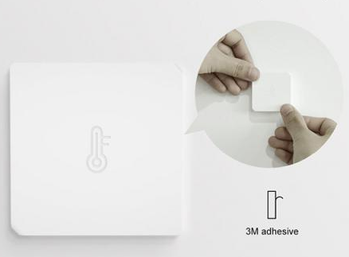
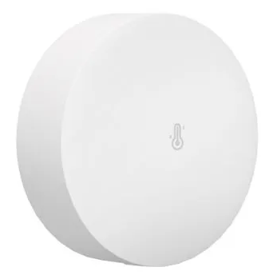
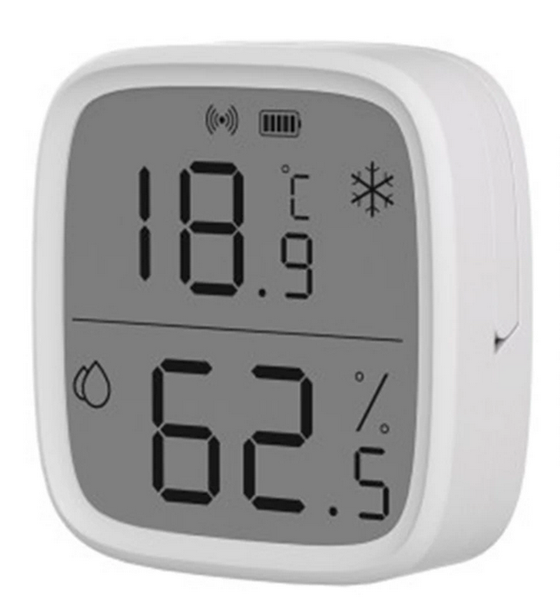

Le Zigbee est un protocole sans-fil comme le wifi ou le bluetooth mais principalement utilisé pour la domotique car il consomme très peu d'énergie ! A titre d'info, je change la pile "montre" selon le signal (plus il est faible et plus sa consomme) environ tous les 6 mois pour les très faibles signals et plus d'un an pour les autres ceci pour les sondes `SNZB-02` (sans écran car je n'ai pas assez de recule pour les autres).  
NB : Je percute que certaines sondes ont plus de 2 ans avec toujours la même pile d'origine (mais le signal est fort car à quelques mètres de la centrale).


 ### Une centrale Zigbee/wifi

Ce boitier, appellé passerelle ou bridge (j'utiliserai le terme bridge dans ce tuto), va permettre de récupérer les valeurs des sondes Zigbee et renvoyer ses informations sur le Wifi.  
Par défaut, il est fourni avec un firmware qui communique sur le net sur AWS (Amazon) et le cloud chinois du constructeur SonOff. Nous verrons plus loin comment flasher ce boitier avec un firmware open-source qui communiquera uniquement en local.

Le modéle utilisé dans ce tuto est un "`Sonoff ZB Bridge`" (dite version de base/standard) pour environ 10€.  
Il existe également en version Pro qui tourne sur un ESP-32 (plus puissant que le ESP8266) mais la version standard est largement suffisant pour une quinzaine de sondes. Il faut compter environ 20€ pour la version pro.  
Ces 2 modèles seront abordés durant ce tuto (la version Pro est carrément plus galère à flasher mais plus simple à souder).  
Si vous débutez en domotique et/ou n'êtes pas très à l'aise avec l'électronique et l'IoT (internet des objets), je conseil fortement le modèle standard plus simple à installer/configurer. La plus-value de la version pro est très faible pour les débutants car la portée sans-fil reste la même et à part si vous souhaitez installer plus de 32 sondes/équipements ou faire plus de règle conditionnelle de votre domotique je conseil la version "standard" (et même pour ce dernier point, je conseil de le faire avec d'autres outils comme Domoticz, Node-red,... car plus flexible et sans code).

Comme il y a un module wifi dedans (consommateur d'énergie). Le bridge, à l'inverse des sondes (sur pile), doit être branché sur secteur via un câble micro-USB (5V 1A). Il est préférable de le placer au milieu de la maison/appartement pour réduire la consommation des sondes. Il faut également que ce boitier soit couvert en wifi (le même que votre raspberry PI).

Voici le boitier (le format et les dimensions sont identiques pour la version standard et pro) mais idem que les sondes, il est très discret (blanc de 6x6x1cm) :  
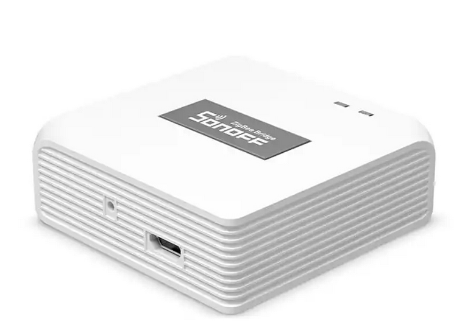


### Divers pré-requis

Il y a d'autres achats à prévoir :  
* Des piles "montre" de rechange : des CR2450 (perso je commande des plaquettes de 10 piles).
* Une alimentation microUSB pour le bridge (5V 1A), en général un vieux chargeur de téléphone suffit (le bridge est fourni avec un câble microUSB mais pas l'alimentation).
* Une clé FTDI (c'est un adaptateur USB/Serial qui permettra de flasher le bridge mais j'y reviendrai).
* Un câble miniUSB (attention pas micro mais bien mini) pour la clé FTDI (il est possible d'acheter le câble avec la clé).
* Câble dupont, pince croco,... pour le câblage nécessaire lors du flashage.
* Adhésif double-face pour le bridge (si fixé au mur).
* Une tournée de bière pour l'auteur de ce tuto quand votre domotique fonctionnera.


## Explications sur le fonctionnement

Histoire d'avoir un peu de visibilité sur la suite du tuto, voici le fonctionnement de l'ensemble global.


1°) Les sondes envoient les informations à la centrale/bridge (via Zigbee).  
Bien entendu nous retrouvons la température et l'humidité mais pas que ! Nous avons également le niveau de batterie, le signal zigbee,...  
Le gros avantage c'est que les sondes SonOff n'envoient les informations que si il y a des changements ou grosses variations (bref si la température est stable, ça ne consomme pratiquement rien).


2°) La centrale (le bridge) va envoyer les informations reçues via le protocole MQTT en Wifi.  
Le protocole MQTT utilise ce qu'on appel le PubSub (pour **pub**lisher/**sub**scriber). En gros la centrale va envoyer (publisher) des infos sur ce MQTT et nous allons ensuite mettre en place des "subscribers" qui vont récupérer en live les infos.  
Sans rentrer dans les détails, il faut voir ça comment twitter (désolé pour l'analogie foireuse) : un utilisateur publie un tweet et c'est uniquement les followers qui le reçoivent.  
Le gros intêret c'est que nous allons configurer la centrale pour publier et nous pourrons rajouter plusieurs "subscribers" sans toucher la conf de la centrale.


3°) Côté Raspberry : après avoir installé un serveur MQTT (indispensable pour l'étape 2), nous allons souscrire aux infos diffusées par la centrale.  
Nous enverrons ces données après formatage dans une base de donnée.


4°) A partir des infos en base de donnée, nous pouvons maintenant grapher sur une interface Web.

NB : L'installation ne se fera pas dans l'ordre ci-dessus d'où ces explications. Nous suivrons plutôt cet ordre :  
* La centrale/bridge car comme son nom l'indique c'est le point centrale de notre domotique, il fait la liaison entre les sondes et le Raspberry
* Le serveur MQTT sur le raspberry
* La configuration des sondes/centrale
* Les collecteurs et les graphs sur le raspberry


## Flasher le bridge

### Explications sur le flash


Comme vu dans les pré-requis, le fonctionnement de base du boitier SonOff est prévu pour être utilisé via une application android/iphone en passant par internet et surtout le cloud AWS (c'est le mode de fonctionnement pour les noobs).  
En faite le matériel Sonoff (ça concerne aussi les prises connectés, les interrupteurs, ...) sont basés sur un micro-controlleur nommé ESP8266 (pour la version standard) ou ESP-32 (pour la version pro) très connu des bidouilleurs DIY : c'est un arduino sous stéroïde car équipé de Wifi (voir du bluetooth pour le ESP-32) pour environ 5€/pièce.  
Il est donc possible de flasher complètement ce composant de manière relativement simple.

C'est ce que nous allons faire pour le remplacer par le firmware open-source [Tasmota](https://tasmota.github.io/docs/).

Il est nécessaire d'avoir :
* Un fer à souder
* Un peu d'étain
* quelques fils fin et/ou dupont
* Une clé USB serial FTDI (une fois de plus, je vais y revenir)


NB : Pour ceux me connaissant IRL, je peux faire toute la partie soudure/flash si vous le souhaitez ayant tout le matos et je n'en suis pas à la première ;)  


### Soudures et cablage

Il y a un peu de soudure et de câblage à faire pour flasher le firmware. Le câblage varie selon le modèle du bridge SonOff.

Le but étant de pouvoir le connecter à la clé USB FTDI suivante :

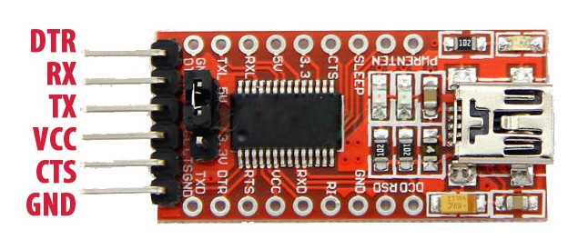

Pour ceux qui connaissent un peu le système, c'est un adaptateur de type USB/serial. Vous pouvez trouver cette clé sur [AliExpress](https://fr.aliexpress.com/item/2019244368.html) pour environ 1,5€ (sans le cable miniUSB).  


**Attention** : 
* La clé FTDI nécessite un cable miniUSB et non microUSB (comme sur les vieux appareils photos).
* **Ne jamais brancher l'alimentation 5V USB du matériel SonOff lors du flash !** (je ne vous parle même pas des prises 230V connectées) : L'alimentation se fera par la clé FTDI en 3V3 au lieu de 5V.
* La liaison RX/TX doit être croisée (c'est à dire que le TX du bridge doit être sur le RX de la clé et inversement).

Ne branchez pas la clé FTDI sur votre PC avant d'avoir fini toutes les soudures, le câblage et la vérification du câblage (jamais trop prudent). Je vous dirai quand le faire si vous suivez ce tuto dans l'ordre.


#### ZbBridge (standard)

La soudure sur le modèle standard ZbBridge est assez galère, personnellement j'ai soudé des petits fil très fin et j'utilise des pinces croco de l'autre extrémité pour les relier à la clé FTDI.  Une fois le flash terminé et avant de refermer le boitier, j'ai rajouté du scotch sur chaque extrémité des fils (dénudés) pour éviter les court-circuits.

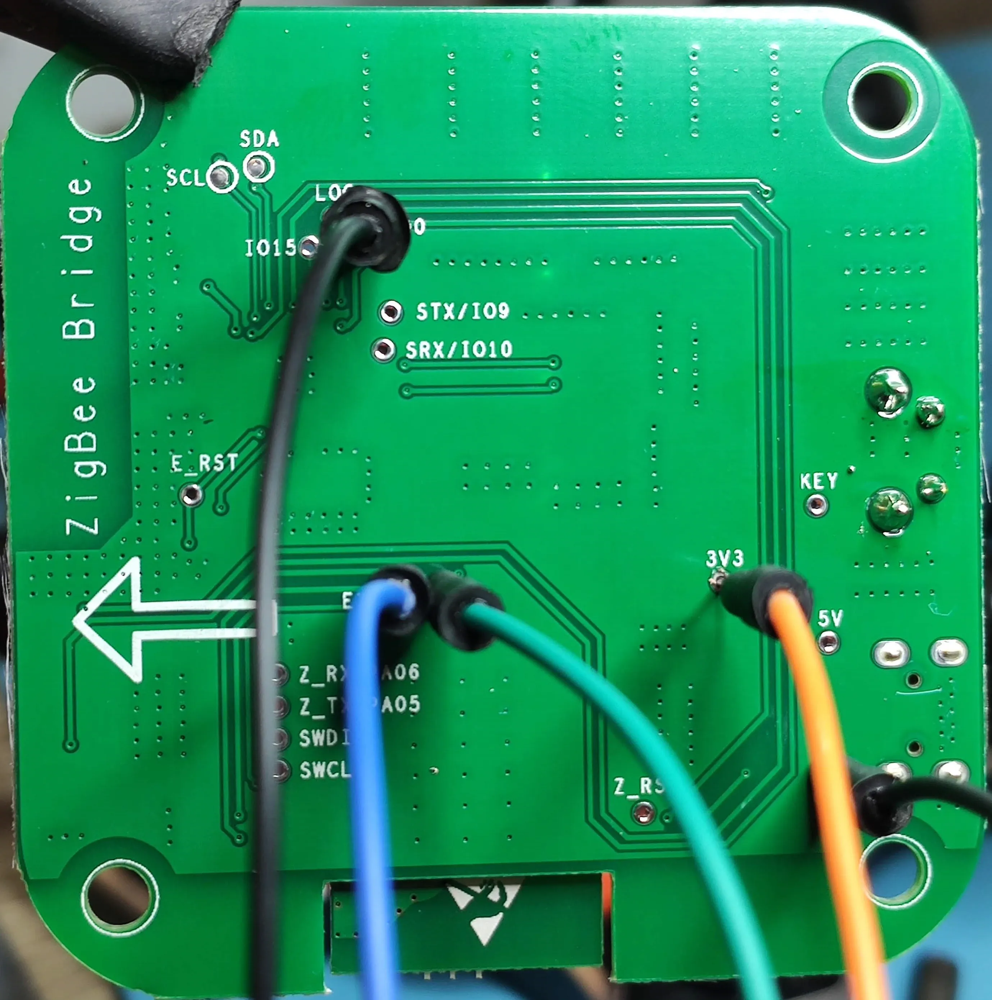  

*Copyright : Image honteusement pompée sur le site tasmota*
Voici le câblage :
| ZbBridge   | Clé FTDI |
|------------|----------|
| ETX        | RX       | 
| ERX        | TX       |
| IO0        | GND      |
| GND        | GND      |
| 3V3        | VCC      |

Les broches `IO0` et `GND` du bridge doivent bien être reliées à la pin `GND` de la clé FTDI (c'est ce qui permet de démarrer la carte en mode flashboot).


#### ZbBridge Pro

Carrément plus simple que sa petite soeur car il est possible de mettre directement des pins dupont d'empattement 2,54". Je pense que le constructeur SonOff est clairement ouvert à ce que les utilisateurs flashent leur matériel vu cet upgrade entre la version classique et la pro (et aussi visible sur la plupart de leur matos dernièrement).


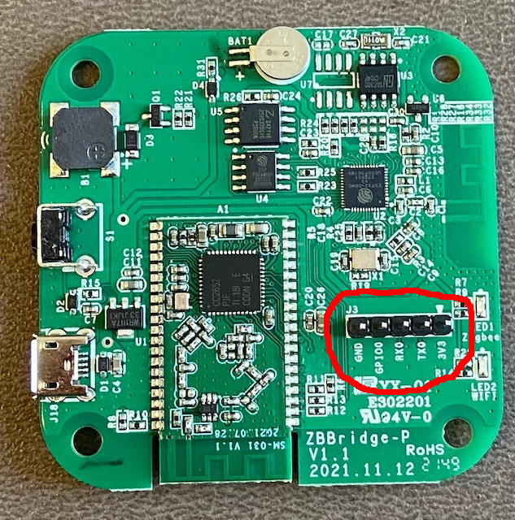

*Copyright : Image honteusement pompée sur le net*

| ZbBridge Pro | Clé FTDI |
|--------------|----------|
| GND          | GND      |
| GPIO0        | GND      |
| RX0          | TX       |
| TX0          | RX       | 
| 3V3          | VCC      |

Les broches `GPIO0` et `GND` du bridge doivent bien être reliées à la pin `GND` de la clé FTDI (c'est ce qui permet de démarrer la carte en mode flashboot). Perso, j'utilise une pince croco qui prend les 2 pins dupont sur la board comme elles sont à côté.


### Flashage

On y est ! Vous pouvez brancher la clé FTDI sur un port USB de votre PC.  
Si il n'y a pas de fumée qui sort du bridge ou du PC, c'est que vous avez fait le plus dur.

Il y a plusieurs manières de flasher, on va voir la plus simple puis une deuxième que j'utilise (car j'ai d'autres ESP à flasher pour d'autres projets).


#### Méthode de noob (uniquement pour la version standard)

* Ouvrez votre navigateur Chrome, Chromium ou Edge (Firefox ne support pas encore le Web Serial).
* Rendez-vous sur [https://tasmota.github.io/install/](https://tasmota.github.io/install/)
* Sélectionnez le firmware "Tasmota Zbbridge" pour la version standard
* Cliquez sur "Install"

Voilà c'est fait après quelques secondes. Vous pouvez débrancher la clé FTDI et votre câblage temporaire.


#### Méthode de barbu (indispensable pour la version pro)

J'utilise [ESP_Flasher](https://github.com/Jason2866/ESP_Flasher) sous Linux cependant l'outil est codé en python donc ça doit fonctionner sous Windows également mais pas testé, il faut juste un environnement python correct sous Windows (petite dédicace à Stéphane) :

* RTFM du lien ci-dessus pour l'installation
* Lancez la commande `esp_flasher` pour avoir l'interface graphique de l'outil
* Téléchargez la dernière version du fichier `.bin` pour flasher le bridge disponible ici (selon votre modéle) :
    * Version standard : [tasmota-zbbridge.bin](https://ota.tasmota.com/tasmota/release/tasmota-zbbridge.bin)
    * Version pro : [tasmota32-zbbrdgpro.bin](https://ota.tasmota.com/tasmota32/release/tasmota32-zbbrdgpro.bin)


NB : Il est possible (sous Linux) que `ESP_Flasher` n'ait pas les droits sur les ports séries du PC (la clé FTDI). Perso j'ai utilisé la commande suivante après l'avoir branché (à adapter bien entendu) :  
```bash
sudo chmod a+rw /dev/ttyUSB0
```


## Configuration de base

Maintenant que le bridge est flashé, nous allons faire la configuration de base.  
Je conseil de garder le boitier toujours ouvert (mais **bien décablé de la clé FTDI** qui est nécessaire uniquement pour le flash) car en cas de problème, il sera indispensable de reflasher (il n'y a pas de bouton reset).

La configuration de base va se limiter à ceci :
* Configurer le wifi.
* Configurer le modèle de boitier

Nous verrons la configuration plus poussée après.

**ATTENTION** : Pour la version pro (uniquement), le flashage n'est pas du tout terminé car les images fournies sont (à l'heure où j'écris ces lignes) toujours en cours de dev !  
En faite nous avons installé une version de base (factory), il reste plusieurs étapes que nous verrons plus tard mais pas de panique, la majorité des opérations va se faire via une interface Web.


### Configurer le Wifi

* Branchez maintenant votre bridge sur le secteur via le port microUSB (tout les câbles utilisés pour le flashage FTDI doivent être débranchés avant).  
* Après quelques secondes vous devez voir un hotspot wifi non sécurisé du genre `tasmota_XXXXXX-####` (où `XXXXXX` est issue de l'adresse MAC du boitier et `####` un nombre random).
. Connectez votre PC ou mobile sur ce hotspot.
* Rendez-vous via votre navigateur sur l'adresse suivante : [http://192.168.4.1](http://192.168.4.1) (NB : selon votre réseau, votre navigateur, OS,... il est possible que vous soyez directement redirigé sur cette adresse).
* Vous arrivez sur la page de configuration du Wifi.
* Cliquez sur "`Save`"

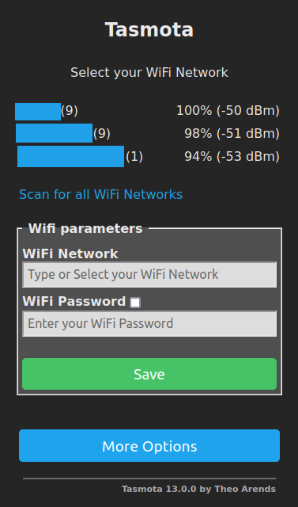


Selon les navigateurs, OS, votre config réseau... vous êtes soit redirigé sur la nouvelle IP sinon il faut vous reconnecter sur votre Wifi perso et saisir la nouvelle IP du boitier dans votre navigateur. 

**Attention** : Le hotspot tasmota est actif que 3 minutes pour des raisons de sécurité, si vous loupez cette fenêtre de tir, il faut couper l'alimentation du boitier pendant 5 secondes et la rebrancher.


Pour la version standard uniquement : Si votre bridge est connecté à votre wifi et que vous avez accés à son interface Web via son IP, vous pouvez dès maintenant refermer le boitier (pensez à mettre du scotch si nécessaire sur chaque fils dénudé dedans utilisés lors du flash) et vous pouvez mettre le bridge à sa place définitive avec son alimentation microUSB. Nous ferons tout le reste via l'interface Web.  

Scotch sur la partie dénudée du câble :  
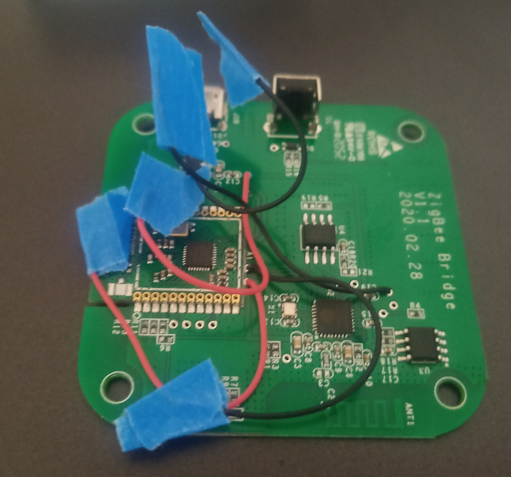

*Copy~~right~~left : Image honteuse et bien crade mais de chez moi.*

Pour la version pro, il reste des opérations pour le flash donc il est préférable de garder le boitier ouvert (en cas de mauvaise manip, il faudra reflasher).


Autre information qui peut servir, si vous configurez le boitier pour la première fois chez vous mais que ce n'est pas la destination final du bridge (maison secondaire,...), il est possible de configurer 2 réseaux wifi ! Ce n'est pas proposé lors du hotspot mais il suffit de se reconnecter sur le boitier quand la configuration initiale Wifi est OK et d'aller dans `Configuration` => `Configuration Wifi` :

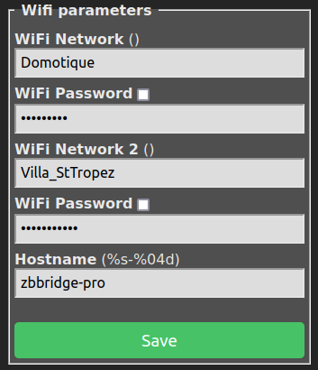

Une fois de plus : faites attention à bien saisir les bons mdp des accès wifi ! Et je conseil de resaissir celui du 1er wifi avant de valider.


### Configuration du modèle de boitier

Une fois reconnecté sur l'interface Web du boitier, vous pouvez faire les actions ci-dessous.  
Certaines actions nécessitent un reboot du boitier mais c'est très rapide (le plus long étant la reconnexion Wifi et le DHCP de votre réseau).

Voici les modifications à faire dans le menu "`Configuration`" => "`Configuration Other`" :
* Template selon votre modèle (attention c'est en une seule ligne) : 
    * Standard :   
    ```{"NAME":"Sonoff ZbBridge","GPIO":[56,165,0,166,215,0,0,0,6,158,5,0,17],"FLAG":0,"BASE":75}```
    * Pro :  
    ```{"NAME":"Sonoff Zigbee Pro","GPIO":[0,0,576,0,480,0,0,0,0,1,1,5792,0,0,0,3552,0,320,5793,3584,0,640,608,32,0,0,0,0,0,1,0,0,0,0,0,0],"FLAG":0,"BASE":1}```
* Cochez bien la case `Activate` sous le template
* "Web Admin Password" : Perso, je n'en met pas car ma domotique est sur un réseau/VLAN très restreint coupé du monde et de mon réseau perso mais je conseille de mettre un mdp qui sera requis lors de la connexion à l'interface Web (attention car en cas de perte, un flash sera nécessaire).
* "HTTP API enable" : `Décoché` (car non traité dans ce tuto)
* "MQTT enable" : `Coché` (utilisé dans ce tuto mais plus loin)
* "Device Name" : `zbbridge`
* "Friendly Name" : `zbbridge`
* "Emulation" : `None`

Quelques explications quand même :  
Tasmota (le firmware) gère un paquet d'équipement (toujours basé sur ces fameux micro-composants ESP-32 ou ESP-8266), nous venons de lui expliquer via le template à quoi sert chaque broche de ce composant (par exemple : sur des prises connectées il peut comprendre le bouton physique on/off, sur des ampoules la broche qui réglera le niveau de luminosité,...).
Dans le cadre de note bridge, nous pouvons même gérer les 2 leds présentes sur le boitier mais il n'y a clairement aucun intérêt.


## Installation des drivers (pour la version pro uniquement)


Pour la version standard, vous pouvez directement passe à la suite : [le MQTT](#mqtt). Ne lancez surtout pas ces opérations sur la version standard !!!

Comme expliqué plus haut, le flashage n'est malheureusement pas terminé pour la version pro car il manque les drivers ZigBee. Il va falloir les installer et les compiler.  
Gros soucis, il n'y a pas assez de place pour installer ces drivers, il faut donc modifier la taille de la partition !  Pas de panique, ça reste assez simple (mais un peu long).


### Partition Wizard

* Téléchargez le fichier suivant [Partition_Wizard.tapp](https://github.com/arendst/Tasmota/raw/development/tasmota/berry/modules/Partition_Wizard.tapp) sur votre ordinateur.
* Sur tasmota dans le menu "`Consoles`" => "`Manage File system`" => uploadé le fichier à l'aide du bouton "`Parcourir`" et "`Start Upload`"
* Revenez sur le menu principal, via les boutons en bas de l'écrans ("`Consoles`" puis "`Main Menu`")
* Redémarrez le boitier avec le bouton "`Restart`" (l'installation du module va se faire durant le boot).
* Une fois redémarré, allez dans "`Consoles`" => "`Partition Wizard`"
* Vous pouvez cliquez sur "`Start Migration`" et partir boire un café ou une bière.

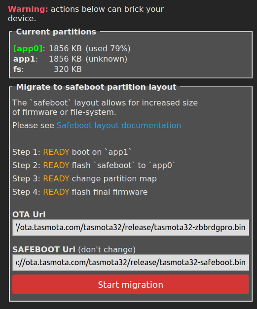


Une fois le café ou la bière (ou les 2 au shaker avec une paille) terminé, vous pouvez retourner dans `Consoles` => `Partition Wizard` et modifier la taille de la partition à `1152` et valider avec `Resize FS`. L'interface se recharge une fois terminé :

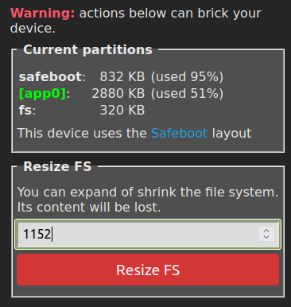


### Upload des fichiers

Nous allons maintenant uploader tout les fichiers nécessaires dans "`Consoles`" => "`Manage File system`". Voici les fichiers à mettre :
* [cc2652_flasher.be](https://raw.githubusercontent.com/arendst/Tasmota/development/tasmota/berry/zigbee/cc2652_flasher.be)
* [intelhex.be](https://raw.githubusercontent.com/arendst/Tasmota/development/tasmota/berry/zigbee/intelhex.be)
* [sonoff_zb_pro_flasher.be](https://raw.githubusercontent.com/arendst/Tasmota/development/tasmota/berry/zigbee/sonoff_zb_pro_flasher.be)
* [SonoffZBPro_coord_20230507.hex](https://raw.githubusercontent.com/arendst/Tasmota/development/tools/fw_SonoffZigbeeBridgePro_cc2652/SonoffZBPro_coord_20230507.hex) (beaucoup plus gros)

### Vérification du code

Ouvrez un nouvel onglet de votre navigateur Web (Firefox, Chrome,...) dans `Consoles` => `Console` et gardez le ouvert pour vérifier les logs.

Allez dans votre onglet principal (gardez celui sur `Console` dans un coin) puis allez dans "`Consoles`" => "`Berry Scripting console`" et collez le bloc suivant :
```python
import sonoff_zb_pro_flasher as cc
cc.load("SonoffZBPro_coord_20230507.hex")
cc.check()
```

Après quelques secondes voir une minute, dans votre onglet `Console` (où vous avez les logs), vous devriez avoir quelques choses de similaire :
```
19:26:44.358 FLH: Starting verification of HEX file
19:27:04.331 FLH: Verification of HEX file OK
```

Si la vérification n'est pas OK c'est que la version du fichier n'est pas bonne et ce n'est pas utile d'allez plus loin dans le tuto !  
Vérifiez plutôt sur cette page si une version plus récente du fichier .hex est disponible : [SonOff_cc2652](https://github.com/arendst/Tasmota/tree/development/tools/fw_SonoffZigbeeBridgePro_cc2652) et relancez la procédure avec ce nouveau fichier (supprimez l'ancien, uploadez le nouveau et relancez les commandes en adaptant le nom du fichier bien entendu).

Si et seulement si tout est OK, vous pouvez lancer la compilation qui prend environ 8 minutes :

```python
cc.flash()
```
Laissez tourner le bridge sans rien toucher pendant 10 bonnes minutes, il ne sera pas verbeux dans les logs (idem vous pouvez perdre la main le temps du flash) mais c'est tout à fait normal. Il faut juste être patient avec ce CPU de 160MHz et ses 512 Ko de SRAM...

A la fin, les logs devraient revenir :
```
19:34:55.814 FLH: Flashing started (takes 5-8 minutes during which Tasmota is unresponsive)
19:42:54.598 FLH: Flashing completed: OK
19:42:54.706 FLH: Flash crc32 0x000000 - 0x2FFFF = bytes('37E109F6')
```
NB : bizarrement, dans mon cas, la 1ère ligne s'est affichée qu'à la fin de la compilation au bout de 8 minutes et pas avant de perdre la main.


## MQTT

Nous allons maintenant nous intéresser au protocole MQTT qui va être le centre de notre domotique. Pour rappel le bridge va envoyer tout ce qu'il récupère des sondes zigbee dessus et nous exploiterons ces informations après.

Petite parenthèse : nous sommes que sur des sondes de températures/humidité mais les prises, interrupteurs, ampoules, wattmetres connectés,... utilisent aussi du MQTT (que ce soit des équipements Zigbee, Wifi ou filaire) ! A titre d'exemple, j'ai des prises connectés zigbee et wifi (chauffage d'appoint,...) que je contrôle via MQTT et j'envoi également d'autres infos sur ce MQTT (celle du Raspberry entre autre) car c'est super simple à envoyer/récupérer (nous verrons bien plus tard).


### Installation d'un serveur MQTT

Nous quittons le bridge (nous allons y revenir très rapidement) pour aller sur le nano-ordinateur (Raspberry PI,...). Je pars toujours du principe que ce dernier est sous Debian/Raspbian.

Avant toute chose (et surtout si ce n'est pas fait récemment), il est conseillé de mettre à jour votre Debian à jour :
```bash
sudo apt update
sudo apt dist-upgrade
```


Nous allons installer un serveur MQTT nommé `mosquitto` :
```bash
sudo apt install -y mosquitto
```

Nous allons créer 2 comptes avec des mdp différents sur ce serveur MQTT : un en lecture seule (ro) et l'autre en écriture (rw). A chaque commande un mdp sera demandé 2 fois.  
Notez bien les mdp car ils seront nécessaires à plusieurs moments de la configuration à venir et utilisez des mots de passes complexe (via un générateur) car hormis dans la configuration vous n'aurez pas besoin de les retenir pour votre usage.  
```bash
sudo mosquitto_passwd -c /etc/mosquitto/passwd domotique_ro
sudo mosquitto_passwd /etc/mosquitto/passwd domotique_rw
```
A noter que la première commande contient le paramètre `-c` pour créer le fichier mais pas la seconde car le fichier existe et il s'agit d'ajouter un 2ème compte.  
En cas de mauvaise manipulation/mdp, supprimez le fichier via la commande suivante et recommencez : `sudo rm /etc/mosquitto/passwd`

Normalement il n'y a que les sondes (via le bridge) qui doivent pouvoir envoyer (écriture) sur le MQTT. Pour les collecteurs/graphs, nous seront en lecture seule.

Il faut maintenant mettre les bons droits sur ce fichier pour empêcher la lecture à n'importe qui (il n'y aura que le serveur mosquitto et le compte root qui auront accès au fichier) :
```bash
sudo chmod 600 /etc/mosquitto/passwd
sudo chown mosquitto /etc/mosquitto/passwd
```

Maintenant que nous avons les 2 comptes, nous pouvons interdire les accès anonymes sur le serveur MQTT avec les lignes suivantes dans le fichier de configuration `/etc/mosquitto/conf.d/server.conf` (le fichier n'existe pas par défaut) :
```ini
# Desactivation de l'acces anonyme et definition du fichier contenant les login/mdp
allow_anonymous false
password_file /etc/mosquitto/passwd

# Port d'ecoute
listener 1883
```

Nous pouvons redémarrer le serveur pour prise en compte de cette nouvelle configuration (et vérifier que tout roule avec une pastille verte "running"):
```bash
sudo systemctl restart mosquitto
sudo systemctl status mosquitto
```

Nous n'irons pas plus loin sur la configuration de ce serveur MQTT mosquitto dans ce tuto (pour le moment). Notre nouveau fichier `/etc/mosquitto/conf.d/server.conf` écrase la configuration d'origine pour notre besoin minimal. Si vous souhaitez poussez plus loin n'hésitez pas à le compléter via la [documentation officiel de mosquitto](https://mosquitto.org/man/mosquitto-conf-5.html).


### MQTT Explorer : un client MQTT

Pour vérifier le bon fonctionnement, nous allons installer un client MQTT sur votre PC (pas sur le raspberry mais bien votre PC raccordé au même Wifi que le serveur mosquitto).  
J'utilise MQTT-Explorer qui est très complet et simple d'utilisation (et dispo sous Windows, Linux, MAC,...).  
Je vous laisse faire l'installation via [le site officiel](https://mqtt-explorer.com/). Pour Linux (même sous Ubuntu), je conseil d'utiliser le format AppImage qui est portable.

Une fois lancé, vous pouvez vous connecter (le compte en lecture seule suffit dans un premier temps mais vous pouvez également vérifier que le compte en écriture fonctionne) :

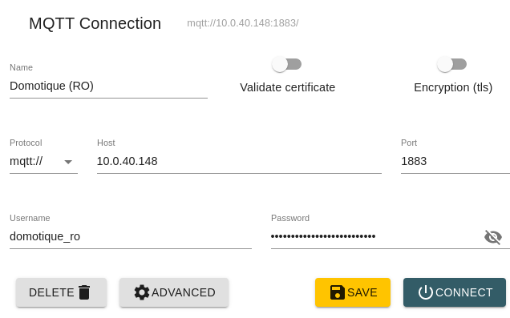

Il faut bien sûr adapter l'adresse IP/hostname avec celle du Raspberry où est installé votre serveur MQTT mosquitto.

Je conseil **fortement** de laisser tourner MQTT Explorer durant toute la suite du tuto.  
En effet avec MQTT, il n'y a pas d'historique. Vous ne verez que les nouvelles informations diffusées après votre connexion.

Lors de la 1ère connexion vous ne devriez avoir que la branche `$SYS` qui contient les informations du serveur mosquitto. Nous allons voir juste après comment diffuser sur d'autres branches.


### Configuration du bridge pour envoyer en MQTT

Vous pouvez retourner sur l'interface Web tasmota du bridge puis :
* Menu "`Configuration`" => "`Configure MQTT`" :
    * Host : L'adresse IP de votre serveur MQTT (le raspberry). Si possible, je déconseil d'utiliser un hostname car le client DNS n'est pas très glorieux sur Tasmota, il est donc préférable de bien fixer l'adresse IP de votre raspberry sur votre DHCP mais ceci fonctionne avec un hostname (je n'ai pas refait de test dernièrement, il est possible que ça soit mieux depuis quelques versions de Tasmota).
    * Port : `1883`
    * MQTT TLS : `Décoché`
    * Client : `ZBbridge` ou `ZBbridgePro` (en faite peut importe mais il faut que le client soit unique sur tout votre réseau MQTT)
    * User : `domotique_rw`
    * Password : Le mot de passe du compte en écriture `domotique_rw` créé lors de l'installation de mosquitto sur le Raspberry PI.
    * Topic : `zbbridge`
    * Full topic : `tasmota/%topic%/`

Une fois le formulaire rempli, vous pouvez sauvegarder (un reboot du boitier sera fait).

Si vous avez bien suivi mon conseil de laisser tourner MQTT Explorer, vous devriez voir une nouvelle branche apparaitre après quelques secondes/minutes.  
En effet, nous n'avons pas encore rajouté de sonde mais le bridge envoi déjà des infos sur son propre état via MQTT dans `/tasmota/zbbridge/STATE`.

Les informations sont mise à jour à interval très régulier. Petite astuce sous MQTT-Explorer : sur les valeurs numériques, vous pouvez les grapher rapidement, il suffit de cliquer sur le petit icone "graph" devant la valeur. Par exemple ici avec la valeur `Signal` qui correspond au signal wifi du bridge :  
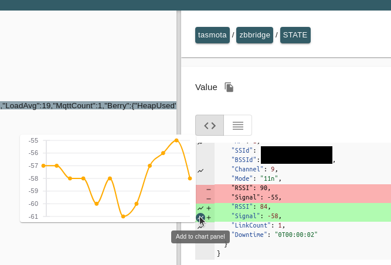

Vous comprenez l'intêret de laisser tourner MQTT-Explorer durant plusieurs heures (en attendant d'avoir des jolies graph avec un historique) ?

Nous allons en profiter pour faire quelques modifications sur le bridge via la console. 
Sur l'interface web tasmota => "`Consoles`" => "`Console`". Il suffit de valider chaque commande avec la touche "Entrée". 

`SetOption89 1` : Ceci permet de séparer chaque sonde dans une branche MQTT différente. C'est indispensable car sinon votre sonde de la chambre va écrire dans la même que le salon et il faudrait vérifier en temps réel quelle sonde a écrit. C'est mieux d'avoir une branche différente et vérifier à intervalle plus raisonnable.

`SetOption83 1` : On va y revenir très vite mais ceci permet de renommer les sondes avec un nom plus commun comme "Salon" au lieu de "0xF5F8".

`SetOption112 1` : Permet de régler des soucis de topic (branche) sur MQTT (principalement pour facilité les collecteurs de graph que nous verrons plus tard).


La liste de toutes les commandes est disponible [sur la documentation tasmota](https://tasmota.github.io/docs/Commands/#zigbee). Nous en verrons quelques unes durant ce tuto.


## Backup


A ce stade de l'installation, vous pouvez déjà faire un backup (étape que je conseil de faire régulièrement par exemple après l'ajout de chaque sonde) :
* Menu "`Configuration`"
    * "`Backup Configuration`"

NB : Les backups contiennent que la configuration Tasmota mais pas du tout l'image du firmware,... Ils permettrons de retrouver la conf opérationnelle mais pas du tout de reflasher avec le backup. Il faut voir ça comme un backup de votre dossier personnel sous Windows. En cas de crash de l'OS/firmware, il vous permettra de retrouver la configuration de votre OS mais ne remplacera pas la ré-installation/flashage de l'OS/firmware.

J'en profite pour placer le fait qu'**il ne faut surtout pas** utiliser le menu "`Firmware Upgrade`" pour le moment, nous verrons plus tard car il n'est pas toujours configuré correctement pour les SonOff ZBbridge dans l'état.


## Ajouter des sondes

Voilà ! On y est enfin ! Nous allons pouvoir rajouter des sondes à notre domotique. A ce stade, elles remonteront les infos à la centrale/bridge et la centrale enverra via MQTT toutes les infos sur notre serveur MQTT sur une branche différente que nous pourrons voir sur MQTT-Explorer.

Avant d'attaquer, j'ai quelques recommandations suite à de mauvaises aventures de noobs !  
Je recommande **fortement** (et dans cet ordre) :
* Ajoutez une sonde à la fois, attendez d'avoir tout configurer avant de passer à la suivante.
* Notez la correspondance du nom de la sonde (genre : Salon) et son adresse (un truc similaire à une adresse MAC mais au format 0xF5F8) dans un fichier txt ou sur une feuille (pour ceux qui ont encore des stylos chez eux).
* Faites un backup tasmota du bridge entre chaque ajout (avec un nom clair et daté du fichier pour un éventuel retour arrière).
* Optionnel mais perso j'ai rajouté l'adresse sur une étiquette derrière chaque sonde.

Vous voilà informez et ne pleurez pas si vous avec 10 adresses MAC (sondes) sans savoir à quoi ça correspond sans souffler comme un con dessus pour les identifier ^^ (oui véridique j'ai fait ça la 1ère fois car je ne savais pas encore renommer les sondes et mes branches MQTT étaient foireuses).


### Faire rejoindre une sonde

Pour qu'un équipement Zigbee rejoigne le bridge, il faut l'autoriser. C'est similaire au protocole bluetooth pour coupler 2 équipements (mais sans code pin).  
L'autorisation dure quelques minutes maximum et après chaque ajout, il faut recommencer pour chaque sonde.


Sur l'interface web Tasmota, c'est assez simple car vous l'avez dès la page d'accueil : c'est le bouton "`Zigbee Permit Join`".

Durant les 3 minutes qui suivent le clic, il suffit de laisser le doigt appuyer sur le bouton de la sonde pendant 5 secondes minimum que vous pouvez relacher après le retour visuel suivant :
* sur les sondes sans affichage (SNZB-02) : une led rouge clignote à travers le boitier 3 fois.
* sur les sondes avec affichage (SNZB-02D) : le logo réseau clignote.

Après quelques secondes, nous avons la sonde qui remonte ses infos sur la page d'accueil de tasmota :  
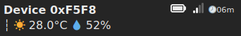  
HS : Oui il fait un peu chaud dans mon salon donc soyez indulgent sur la qualité de ce tuto car je transpire pour le rediger :P


Blague à part, c'est cool : nous avons la température et l'humidité comme souhaité mais également la date de la dernière remontée d'info (ici 6min) ainsi que le niveau du signal de la sonde et son niveau de batterie.  
Le niveau de batterie et du signal sont remontés à interval beaucoup plus large, c'est une remarque à prendre en compte (surtout lors des graphs).  
NS : Sur les sondes SNZ-02D (avec affichage LCD), le niveau de batterie ne semble pas être remonté (uniquement le signal). Bon ce n'est pas bien grave car il est visible directement sur l'écran LCD...

Donc voilà il fait chaud dans ma pièce 0xF5F8 et l'humidité est de 52% mais vous comprenez qu'avec plusieurs sondes 0xXXXXX, cela va vite être problèmatique pour les identifier...


### Renommer une sonde

Bien entendu, il est possible de renommer cette adresse affreuse "0xF5F8" en quelque chose de plus compréhensible. Le truc bien c'est que ça sera répercuté côté tasmota mais aussi MQTT ainsi que sur nos graphs (plus tard).

Donc en console, sur l'interface web tasmota (`Consoles` => `Console`), la syntaxe de la commande est comme ceci :
```
ZbName <AdresseMAC>,<NomDeLaSonde>
```
exemple dans mon cas :
```
ZbName 0xF5F8,Salon
```

La modification est immédiate côté tasmota (sur la page d'accueil) :  
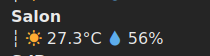  

Côté MQTT (toujours via le client MQTT-Explorer), cela met plus longtemps que du côté de tasmota mais c'est tout à fait normal car il faut attendre que la sonde envoie des nouvelles infos MQTT, on voit également que chaque sonde est bien séparée avec sa propre branche et avec un nom compréhensible dans `/tasmota/zbbridge/Salon`.

NB : Evitez les espaces, caractères spéciaux ou accent dans le nom de la sonde : faites simple ! Lors des graphs, nous pourrons mettre un titre plus propre. Exemple : "Sdb" comme nom de sonde est très bien et nous pourrons le remplacer par "Salle de bain" lors de l'affichage des graphs (d'autres exemples : Entrée => Hall, Extérieur côté Sud => ExtSud,...).


### Perte d'une sonde

Il m'arrive régulièrement (pas d'inquiétude car c'est pas tout les jours non plus mais ça arrive) que la sonde ne soit plus associée au bridge. Dans ce cas la sonde n'envoie plus d'information mais reste bien en mémoire sur le bridge (elle est noté en grisé sur l'accueil Tasmota).  
J'avoue ne pas avoir trop cherché la cause de cette coupure car c'est environ une fois par mois sur une des 14 sondes/équipements zigbee que j'ai actuellement (et c'est pas toujours la/le même) et surtout que la procédure pour le retour est très rapide et simple :
* Réactiver le `Zigbee Permit Join` sur la page d'accueil du bridge.
* Ré-appuyer 5 secondes sur la sonde.

Le nommage est conservé et tout revient dans l'ordre dans les minutes qui suivent (en générale la sonde renvoie directement quelques informations MQTT lorsqu'elle rejoint à nouveau le bridge).  
C'est la même procédure lors du changement de la pile de la sonde.

Ici, une de mes prises connectées zigbee sans signal (que j'ai volontairement débranché pour avoir ce screenshot), elle est grisée au niveau de l'heure de MàJ car le bridge a perdu le signal avec elle :
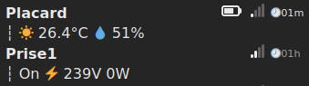


### Supprimer une sonde 

Si la sonde n'a plus lieu d'être sur votre interface Tasmota, vous pouvez la retirer avec la commande suivante :  
```ZbForget <AdresseMAC>```

exemple :  
```ZbForget 0x84DA```

Si vous avez oublié l'adresse de la sonde, vous pouvez la retrouver en survolant son nom sur la page d'accueil Tasmota (ici : `0x28FA`) :  
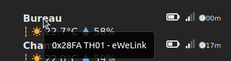


### Nettoyage MQTT

Ajouter, renommer, supprimer des sondes peut vite mettre beaucoup de branche sur votre serveur MQTT. Normalement ce n'est pas nécessaire de purger mais si vous souhaitez le faire pour avoir plus de visibilité sur MQTT Explorer :
* En SSH sur le serveur (rapsberry PI) où est installé mosquitto :
    * Coupez le service mosquitto : `sudo systemctl stop mosquitto`
    * Supprimez la base de donnée : `sudo rm /var/lib/mosquitto/mosquitto.db`
    * Relancer le service : `sudo systemctl start mosquitto`
* Sur MQTT Explorer : Déconnectez-vous et reconnectez-vous. Il faudra attendre que chaque sonde remonte des informations pour repeupler la totalité des branches.


## Mettre à jour le firmware Tasmota du bridge

Avant toute chose faite toujours un backup avant/après avoir modifié la configuration du bridge.  

Les mises à jour peuvent être faite via OTA (c'est à dire par un simple clic sur l'interface sans reflasher la totalité du bridge).  

La version actuellement installée est visible en bas de chaque page de l'interface Tasmota (v13.0.0 au moment où j'écris ces lignes).  
Vous pouvez trouver le numéro de la dernière version disponible en tête de la page suivante :
* [ZbBridge standard (ESP8266)](https://ota.tasmota.com/tasmota/release/)
* [ZbBridge pro (ESP-32)](https://ota.tasmota.com/tasmota32/release/)

L'adresse OTA n'est pas toujours la bonne par défaut (c'est pour ça que je vous avez dit de ne surtout pas lancer de MàJ pour le moment).
Dans la console, lancez la commande suivante selon votre modèle :
* ZbBridge standard : `OtaUrl https://ota.tasmota.com/tasmota/release/tasmota-zbbridge.bin.gz`
* ZbBridge pro : `OtaUrl https://ota.tasmota.com/tasmota32/release/tasmota32-zbbrdgpro.bin`

Maintenant vous pouvez lancer une mise à jour (si une nouvelle version est disponible) via le menu principale dans "`Firmware Upgrade`" puis "`Start upgrade`" (celui du haut).   
Ceci nécessite que le bridge dispose d'une connexion internet. Si comme moi vous l'avez coupé du net (via des règles de firewall), vous pouvez télécharger le firmware via le lien ci-dessus (toujours selon votre version) et uploader le fichier sur le bridge.


## Grapher votre domotique

Nous arrivons sur la partie un peu plus fun car nous allons grapher vos courbes de température/humidité sur une interface Web.

### Explications sur les graphs

Petit rappel sur le fonctionnement global (attention au sens des fléches) :   
Sondes Zigbee ==(via Zigbee)==> Bridge ==(via MQTT sur le Wifi)==> Serveur MQTT <==(lecture via MQTT)== collecteur d'info ==(sauvegarde)==> base de donnée <==(lecture)== interface Web avec nos graphs.

Si vous avez bien compris notre superbe graph (merci à Georges Lucas et James Cameron pour l'aspect très visuel et futuriste de ce graph), il nous reste à mettre en place :
* Un collecteur d'info qui va récupérer (via MQTT) les valeurs et les sauvegarder en base de donnée
* Une interface Web qui va lire les informations en base de donnée pour les grapher.

Une fois de plus nous allons faire l'installation dans un ordre différent (pour éviter le ping pong entre différents outils) !

Nous allons commencer par mettre en place une base de donnée `InfluxDB` qui stockera chaque valeur avec sa date/heure, ce qui vous permettra d'avoir un historique.  
Pour alimenter cette base de donnée, nous utiliserons un collecteur nommé `telegraf` qui va souscrire (en lecture seule) à vos différentes branches MQTT pour récupérer les informations, les formater dans le bon format et les enregistrer dans la base de donnée `influxdb` (donc accès en écriture à cette BDD).  
Et pour finir nous utiliserons `Grafana` pour afficher les informations de la BDD (accès en lecture seule) sous forme de graph sur une interface Web.


**Avertissements sur la sécurité :**  
Je n'aborderai pas ce sujet dans ce tuto mais il est possible d'avoir les graphs ailleurs que sur votre Raspberry PI (en local). Si c'est ce que vous souhaitez faire (par exemple sur une instance scaleway) pour avoir vos courbes accessibles sur Internet sans exposer votre réseau privé/local sur le net, voici quelques recommandations :
* Je conseil de garder le serveur MQTT et le collecteur en local sur la même machine (le raspberry PI) pour plusieurs raisons :
    * En cas de coupure Internet, le collecteur est capable de mettre en cache les infos et tout ré-envoyer à la base de donnée quand la connexion remonte (dans une certaine limite de donnée/durée bien entendu).
    * Niveau performance, c'est mieux (même si nous ne sommes pas sur des outils qui consomment énormément d'un point de vue bande passante ou qui ont besoin d'une latence très faible), il est préférable d'avoir le collecteur d'information au même endroit que le MQTT qui contient les dites infos.
    * A ce stade du tuto, les flux ne sont pas chiffrés (grand débat de savoir si la température de mon salon est une donnée sensible cependant la connexion à la BDD sera en claire dans un premier temps donc non sécurisée).
* Il est très fortement conseillé de monter un tunnel chiffré entre votre domotique et l'instance influxDB si elles ne sont pas au même endroit (avec `WireGuard` ou `OpenVPN` par exemple).
* Il faut restreindre les accès à votre BDD InfluxDB uniquement à votre domotique (via l'interface du tunnel par exemple et/ou une IP fixe).
* De manière générale, utilisez des mots de passes complexes avec un gestionnaire de mot de passe comme BitWarden ou KeePass.

Bref, si vous voulez exposé votre domotique sur Internet, prenez bien conscience des risques de sécurité comme le piratage, le vol de données (sur votre réseau local via rebond) ou voir (avec de la domotique) d'une prise en main à distance complète de vos équipements (prises connectées, éclairages, caméra, imprimantes 3D,...) par des personnes malveillantes !


### InfluxDB

Si vous avez quelques notions en BDD/SGBD (non nécessaire dans ce tuto), InfluxDB est une base de donnée très accès sur les valeurs temporelles (date/heure de chaque ajout/modification) ce qui correspond à notre besoin (une température à un instant T). De plus elle utilise un système de clés/valeurs et surtout de tag/série. Pour résumer (de manière très triviale), chaque enregistrement aura ces informations :
* Date : La date/heure de la valeur de la sonde
* Série : Le nom de la sonde
* Clé/Valeur (multiple et pas toujours toutes les valeurs) :
    * Humidité : X%
    * Température: X°C
    * Niveau de batterie : X%
    * Signal Zigbee : X%
    * ...

Le système de tag/série va nous permettre de filtrer très rapidement les valeurs que nous cherchons lorsque nous réaliserons les graphs.


**Grosse note sur InfluxDB 2.x :**  

J'ai mis en place ma domotique il y a déjà quelques années et en rédigeant ce tuto depuis zéro, je découvre une interface Web de InfluxDB 2.x vraiment magifique avec des exemples de configuration pour les sondes, des bouts de scripts, un exploreur de BDD,... (à l'époque il n'y avait qu'un point d'accès API).  
Bref grosse surprise et je vais essayer d'orienter la suite du tuto sur cette interface car je sais que certains sont moins à l'aise avec la ligne de commande cependant une ligne de commande change moins dans le temps qu'une interface graphique donc j'espère que le tuto ne deviendra pas obsolète rapidement (un simple remaniement des menus peut vite changer la totalité du tuto).

Edit : La version 2.x propose énormément de chose mais elle est plus complexe à prendre en main, cependant elle permet d'ancienne option que nous utiliserons.


#### Installer la BDD

Au moment où j'écris ces lignes nous sommes sur la version `2.7.1` de InfluxDB.

* Allez sur le site [https://portal.influxdata.com/downloads/](https://portal.influxdata.com/downloads/).
* Dans la 1ère partie (InfluxDB), sélectionnez votre plateforme : `Ubuntu & Debian (ARM 64-bit)` pour Raspberry PI sous Raspbian/Debian (adaptez si vous avez une configuration différente).

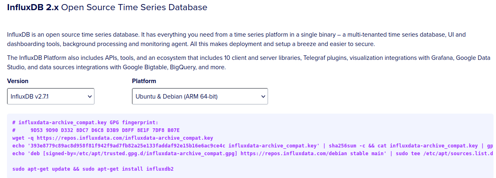


Dans mon cas (adaptez avant de copier bétement ces lignes) :
```bash
wget -q https://repos.influxdata.com/influxdata-archive_compat.key
echo '393e8779c89ac8d958f81f942f9ad7fb82a25e133faddaf92e15b16e6ac9ce4c influxdata-archive_compat.key' | sha256sum -c && cat influxdata-archive_compat.key | gpg --dearmor | sudo tee /etc/apt/trusted.gpg.d/influxdata-archive_compat.gpg > /dev/null
echo 'deb [signed-by=/etc/apt/trusted.gpg.d/influxdata-archive_compat.gpg] https://repos.influxdata.com/debian stable main' | sudo tee /etc/apt/sources.list.d/influxdata.list

sudo apt-get update && sudo apt-get install -y influxdb2
sudo systemctl restart influxdb
```

Nous pouvons vérifier que la base de donnée (non configurée pour le moment) tourne bien avec la commande suivante :  
```bash
influx ping
```

#### Configuration de InfluxDB

Il est possible de faire la configuration de base en CLI (ligne de commande) mais comme une interface graphique très complète est disponible sur les dernières versions, nous allons l'utiliser.  
Cette dernière est accessible via un navigateur Web en HTTP sur le port `8086`. [http://raspberrypi:8086](http://raspberryrpi:8086) (remplacez `raspberryrpi` par l'adresse IP du Raspberry où est installé InfluxDB si nécessaire).

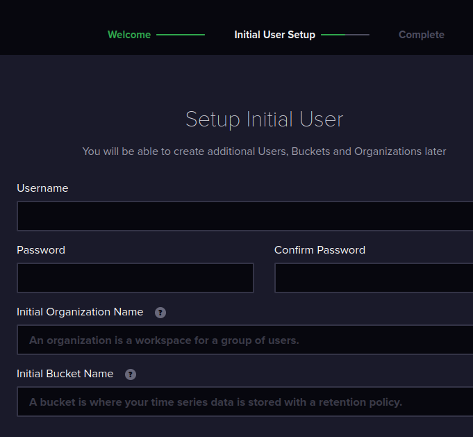

Avant de remplir ce formulaire, quelques informations sur le fonctionnement un peu particulier de InfluxDB surtout pour les gens habitués à MySQL,... :  
InfluxDB utilise un système "d'organisation" qui sépare les données/autoriations par secteur, ce ne sont pas des tables mais bien une section différente (voir ça comme un namespace pour ceux qui connaissent un peu ce concept).

Voici comment j'ai rempli ce formulaire :
* Username : `admin`
* Password : Un mot de passe très complexe aléatoire de 24 caractères car il sera peu utilisé
* Organization : `domotique`
* Bucket : `domotique`

Après avoir validé avec le bouton "`Continuer`", nous arrivons sur une page avec le token admin.  
Il est très important de noter ce token (voir même plus que le mot de passe admin) car il est généré et affiché sur cette page puis haché donc plus du tout accessible de manière lisible par la suite !!!

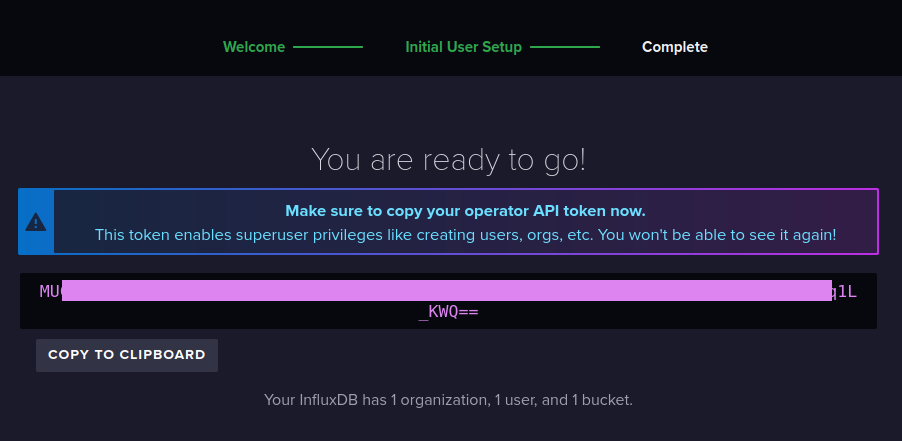

Une fois fait, vous pouvez continuer avec "Configure later".

Nous allons créer 2 autres tokens (notez les bien à chaque fois) :
* Dans le menu à gauche : `Load data` => `API Tokens`
* Sur le bouton à droite : `Generate API Token` => `Custom API Token`
* 1er compte : 
    * Description : `domotique_ro`
    * Bucket : `domotique` (en read)
    * Telegraf : `aucun`
    * Other ressource : `aucun`
* 2eme compte :
    * Description : `domotique_rw`
    * Bucket : `domotique` (en read+write)
    * Telegraf : `aucun`
    * Other ressource : `aucun`

A ce stade, nous avons 3 tokens :
* `admin` : qui servira pour la gestion complète d'influxDB
* `domotique_ro` : un token en lecture seule qui lira les données uniquement
* `domotique_rw` : un token en lecture/écriture pour le collecteur

Pour la suite du tuto, il est nécessaire de récupérer l'ID du bucket.  
Vous pouvez le récupérer dans "`Load data`" => "`Buckets`" :

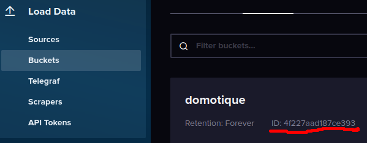

Le système de token est spécifique à la nouvelle version d'influxDB mais pour une prise en main plus rapide (de l'outil de graph), nous allons aussi créer un compte en lecture seule "legacy" (c'est à dire pour l'ancienne version) :
```bash
influx v1 auth create --username domotique_ro -o domotique --token <TOKEN_ADMIN> --read-bucket <ID_BUCKET>
```
Bien entendu, remplacez les variables suivantes dans cette commande :
* `<TOKEN_ADMIN>` : par le 1er token admin car c'est le seul qui a les droits pour gérer les créations de compte
* `<ID_BUCKET>` : par l'ID du bucket domotique récupéré juste avant (pour donner les droits de lecture à ce compte)  
Un mot de passe est demandé pour ce compte "legacy" (utilisez un générateur et noté le bien).


### Telegraf

Telegraf est un collecteur qui va récupérer plein d'info à gauche et à droite et va les envoyer en BDD.  
C'est un outil très complet composé de 2 types de configuration :
* Les "inputs" (les données collectées) peuvent venir d'énormément de source : internet, cpu, MQTT, API, Docker, SNMP, fichiers,...
* Les "outputs" (où envoyer les données), généralement une base de donnée (InfluxDB, MySQL,...) mais aussi MQTT, HTTP,...


#### Installation de Telegraf

L'installation est très simple si vous avez suivi la procédure d'installation d'InfluxDB (sinon il faut à minima faire toute la partie d'ajout des dépôts) :
```bash
sudo apt-get install -y telegraf 
```


#### Configuration de Telegraf

La configuration se passe normalement dans l'unique fichier `/etc/telegraf/telegraf.conf` où vous avez la totalité des inputs/outputs possibles avec leurs valeurs par défaut mais non activé par défaut.  
Personnellement, je préfère utiliser un fichier par modules dans le dossier `/etc/telegraf/telegraf.d/`.

Nous allons commencer par configurer notre unique "output", la base de donnée InfluxDB.  
Créons un nouveau fichier `/etc/telegraf/telegraf.d/output.conf` avec le contenu suivant :
```toml
[[outputs.influxdb_v2]]
    # URL de la base de donnée (stocké sur le même équipement que telegraf ou sinon à adapter)
    urls = ["http://127.0.0.1:8086"]

    # Token d'authentification
    token = "METTEZ ICI VOTRE TOKEN INFLUXDB DU COMPTE EN LECTURE/ECRITURE domotique_rw"

    # Nom de l'organisation
    organization = "domotique"

    # Nom du bucket
    bucket = "domotique"

    # On exclue le nom du bucket des metriques comme on en utilisera qu'un
    exclude_bucket_tag = true
```

Après chaques modifications des fichiers du dossier `telegraf.d`, il faut relancer le service :
```bash
sudo service telegraf restart
```

Quand j'ai dit qu'il n'y avait aucun module "input" d'activé par défaut, ce n'est pas tout à fait vrai, il y a des modules par défaut qui contrôle ce qu'il y a sur l'équipement (le raspberry) qui contient telegraf. Nous retrouvons des informations sur le CPU, la mémoire, l'espace disque, l'utilisation du disque (lecture/écriture),...

Après quelques minutes nous pouvons déjà le vérifier sur l'interface Web d'InfluxDB ([http://raspberrypi:8086](http://raspberrypi:8086)) dans la section "`Data Explorer`" en lançant une recherche comme ceci (à adapter) puis en cliquant sur "`Submit`" (complètement à droite) :  
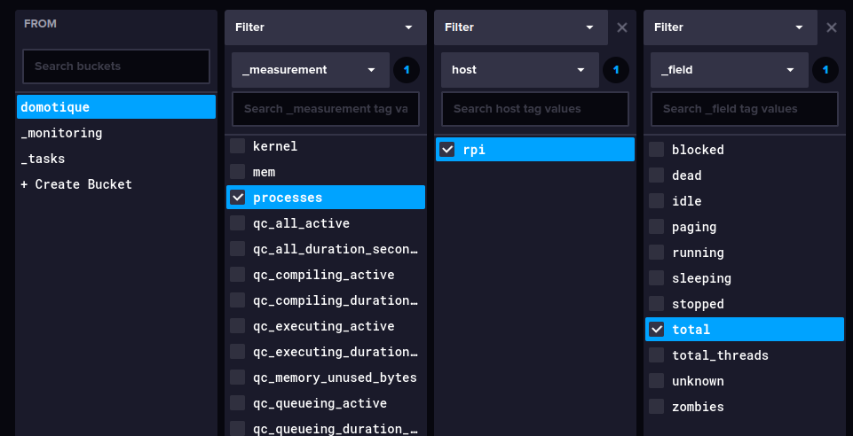

Ceci devrait nous sortir un graph avec le nombre de processus qui tournent sur le Raspberry PI qui héberge telegraf.  

La nouvelle interface web d'influxDB est cool mais ce n'est pas l'outil le plus adapté pour faire des graphs, c'était juste une vérification.  
De plus, je ne détaillerai pas comment faire des graphs (pourtant très intéressant) de votre Raspberry mais je conseil d'en faire par la suite quand vous maitrisserez tout ces outils pour de la surveillance (CPU, espace disque, RAM, débit de connexion,...). En faites, vous pouvez vérifier plein de choses comme votre NAS, box, PC,...

Revenons plutôt à ce qui nous intéresse, c'est à dire notre domotique et les informations présentes sur notre serveur MQTT.

Créons un nouveau fichier `/etc/telegraf/telegraf.d/mqtt.conf` :
```toml
[[inputs.mqtt_consumer]]
    # Interval entre chaque check sur le MQTT
    interval = "30s"

    # Serveur MQTT (normalement en local)
    servers = ["tcp://127.0.0.1:1883"]

    # L'utilisateur MQTT (en lecture seule) et son mot de passe fait lors de l'installation de MQTT (et non d'influxDB)
    username = "domotique_ro"
    password = "MoT De PaSSe CoMpLeXe !!!"
    
    # Les topics MQTT que nous souhaitons suivre
    # Le caractère "+" correspond à un wildcard (c'est à dire tout les topics)
    topics = [
        "tasmota/zbbridge/+/SENSOR",
        "tasmota/zbbridge/STATE"
    ]

    # Le format des données reçues (dans notre cas c'est bien du JSON)
    data_format = "json"
```

N'oubliez pas de relancer telegraf après modification (à chaque fois) :
```bash
sudo service telegraf restart
```

Une fois de plus, vous pouvez vérifier sur l'interface web d'InfluxDB (mais après quelques minutes) que vous avez des valeurs MQTT qui arrivent (pas encore assez de point pour un graph mais on s'en fou) via le `Data explorer` :  
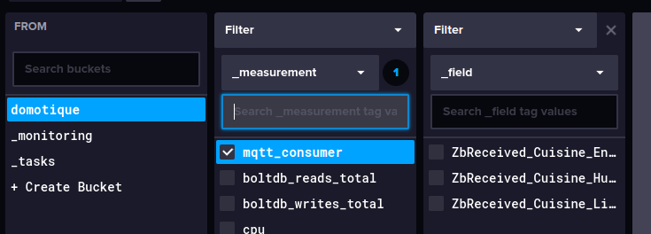

Dans mon cas, nous voyons bien qu'il y a des valeurs remontées par la sonde de la cuisine (pas besoin d'aller plus loin, c'est que tout fonctionne et les autres valeurs remonteront petit à petit).


### Grafana

Nous attaquons la grosse partie où nous allons enfin pouvoir générer des graphs.  
La version installée lors de l'écriture de ces lignes est la v10.0.3.


#### Installation de Grafana

L'installation va être rapide, il suffit de copier ce bloc de lignes dans une console SSH du RaspberryPI :
```bash
sudo apt-get install -y apt-transport-https software-properties-common wget
sudo wget -q -O /usr/share/keyrings/grafana.key https://apt.grafana.com/gpg.key
echo "deb [signed-by=/usr/share/keyrings/grafana.key] https://apt.grafana.com stable main" | sudo tee -a /etc/apt/sources.list.d/grafana.list
sudo apt-get update
sudo apt-get install -y grafana
sudo systemctl daemon-reload
sudo systemctl start grafana-server
sudo systemctl status grafana-server
```

Grafana écoute sur le port 3000 par défaut, vous pouvez vous rendre dès maintenant sur l'interface Web : [http://raspberrypi:3000](http://raspberrypi:3000).  
Le login/mdp par défaut est `admin`/`admin` et avant même la première connexion, il vous est demandé de modifier ce mot de passe.


#### Configuration de Grafana

Nous allons commencer par configurer 2 bases de données en source. Pourquoi 2 alors que nous avons qu'une base de donnée ?
* Notre base de donnée avec le compte legacy car plus simple pour débuter.
* La même base de donnée mais avec "Flux" un langage beaucoup plus puissant mais complexe.

Ceci va nous permettre de gérer/grapher les mêmes données mais de manière différente.

**Rédaction de la suite en cours...**


---------

**ATTENTION : Ce tuto n'est pas complet et la suite est en cours de rédaction, revenez plus tard pour lire la suite !!!**


### TODO du reste du tuto à rédiger : 


* [ ] Graph :
    * [X] Telegraf :
        * [X] Installation
        * [X] Configuration avec un token RO
    * [ ] InfluxDB :
        * [X] Installation
        * [ ] Configuration (en cours: pas fini car il manque des infos)
    * [ ] Grafana :
        * [X] Installation
        * [ ] Configuration (en cours de rédaction/vérification)
        * [ ] Graph
* [ ] Plus loin :
    * [ ] Prise wattmetre connectée :
        * [ ] Calibrage wattmetre
    * [ ] Envoyer des commandes via MQTT :
        * [ ] Client MQTT (python, cli,..)
        * [ ] Permit join
        * [ ] Switch prise
    * [ ] Node-Red
    * [ ] Domoticz
    * [ ] Sécurité :
        * [ ] Tasmota : TLS pas possible
        * [ ] MQTT over TLS
            * [ ] Configuration mosquitto
            * [ ] Vérification MQTT-Explorer
            * [ ] Modification tasmota
            * [ ] Modification telegraph
        * [ ] InfluxDB :
            * [ ] Configuration DB
            * [ ] Modification telegraph
            * [ ] Modification graphana
        * [ ] Grafana
        * [ ] Matrice de flux
        * [ ] Mise à jour Rpi
    * [ ] InfluxDB :
        * [ ] Features sur l'interface Web
    * [ ] ...
* [ ] Splitter le tuto car trop long :
    * [ ] Flashage :
        * [ ] Standard
        * [ ] Pro
    * [ ] Refaire sommaire après splittage

<!--
influx v1 auth create --username domotique_ro --o domotique --token XXXXX --read-bucket e98fe197dec38b6a

-->